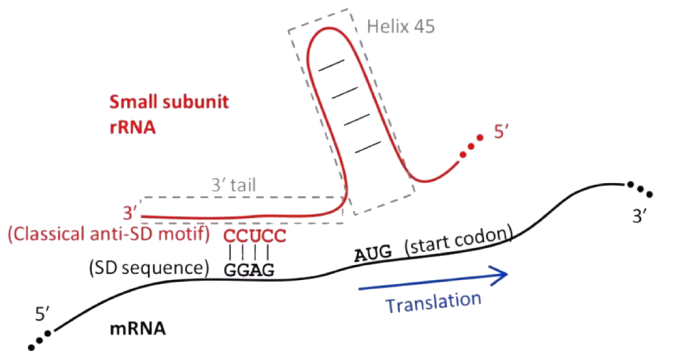
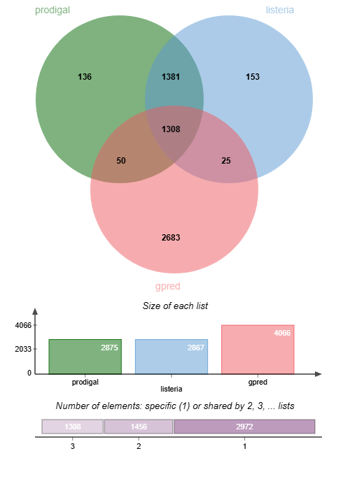

# Gene prediction


## Summary

Genes correspond to a subsequence of transcripts that can be translated into proteins by the ribosome. They have a reading frame consisting of consecutive triplets from an initiation codon ('AUG', 'UUG', 'CUG', 'AUU' or 'GUG') and a stop codon (UAA', 'UAG', or 'UGA'). These codons are in the same reading frame!
We find upstream of the initiation codon a motif allowing the initiation of translation via the binding of the 16S subunit of ribosomal RNA: AGGAGGUAA called the Shine-Dalagarno sequence [\[Shine and Dalgarno 1973\]](https://www.sciencedirect.com/science/article/pii/0022283673905287). This motif is not necessarily in the same reading frame as the initiation codon and may be incomplete.



Few organisms currently benefit from an experimentally verified annotation. Gene prediction therefore remains an important task for the automatic annotation of genomes. Multiple software and approaches exist for this [task](https://en.wikipedia.org/wiki/List_of_gene_prediction_software).

We will develop a simple approach to predict prokaryotic genes based on the detection of reading frames and the Shine-Dalgarno motif. The objective of this practical work will be to predict the genes of the reference genome of [Listeria monocytogenes EGD-e](https://www.ncbi.nlm.nih.gov/genome/browse/#!/proteins/159/159660%7CListeria%20monocytogenes%20EGD-e/) (assembled and sequenced by the Institut Pasteur), which presents 2867 genes.


## Basic usage

```
python3 gpred/gpred.py -i data/listeria.fasta -p predicted_gene_positions.csv -o  predicted_genes.fasta 
```

Available arguments:
```
  -h, --help            show this help message and exit
  -i GENOME_FILE        Complete genome file in fasta format
  -g MIN_GENE_LEN       Minimum gene length to consider (default 50).
  -s MAX_SHINE_DALGARNO_DISTANCE
                        Maximum distance from start codon where to look for a Shine-Dalgarno motif (default 16)
  -d MIN_GAP            Minimum gap between two genes (shine box not included, default 40).
  -p PREDICTED_GENES_FILE
                        Tabular file giving position of predicted genes
  -o FASTA_FILE         Fasta file giving sequence of predicted genes
```

## Example

We can compair the result of gpred compaired to [genome annotation](/data/position.csv) and [prodigal](https://github.com/hyattpd/Prodigal) [complete genes prediction](/data/prodigal.csv) using [jvenn tool](https://jvenn.toulouse.inra.fr/app/example.html):

